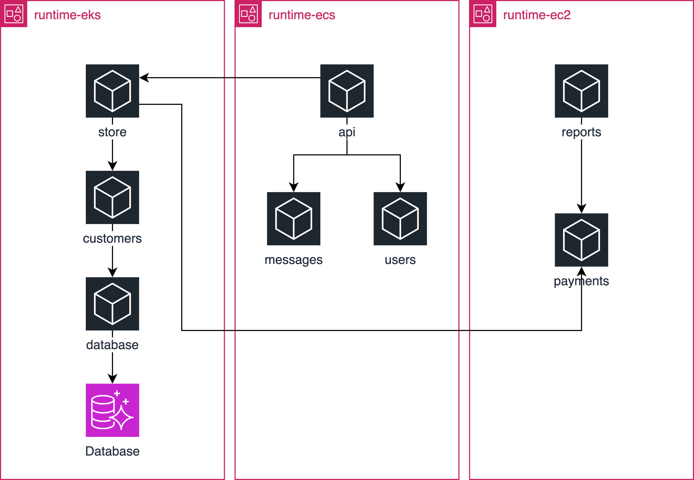

# Foundational Service Oriented Architecture

This is a set of Terraform configuration for multi-account, multi-region,
and multi-runtime on AWS.


The services connect across runtimes



## Directories

Top-level directories have Terraform configuration for each AWS account.

You'll find additional configuration in each directory.

- `scripts` - additional scripts that...
   - Reset Boundary workers (due to instances not being in autoscaling group)
   - Load data into a database
   - Retrieve SSH keys to connect to Boundary (TODO: Add these SSH keys to Vault)
- `modules` - Terraform modules used for a specific runtime or across runtimes
- `region` - module to duplicate resources across regions

## Setup

1. Fork this repository.

1. Set up the following AWS accounts:
   - `root` - root organization
   - `shared_services`
   - `runtime_ec2`
   - `runtime_ecs`
   - `runtime_eks`
   - `runtime_frontend`

1. Create a HashiCorp Cloud Platform organization.
   - HCP Consul must be **plus** tier for cluster peering.
   - HCP Vault must be **plus** tier for performance replication.
   - HCP Boundary can be **cloud** tier.

1. Create a Terraform Cloud organization.

1. Set up a [Terraform Cloud VCS connection](https://developer.hashicorp.com/terraform/cloud-docs/vcs) to your fork.

1. Set up Terraform Cloud workspaces and link them to the following
   working directories in VCS settings.
   - `root` - `root/`
   - `shared-services` - `shared_services/`
       - `shared-services-vault` - `shared_services/vault/`
       - `shared-services-consul` - `shared_services/consul/`
       - `shared-services-boundary` - `shared_services/boundary/`
   - `runtime-ec2` - `runtime_ec2/`
   - `runtime-ecs` - `runtime_ecs/`
       - `runtime-ecs-applications` - `runtime_ecs/applications`
   - `runtime-eks` - `runtime_eks`
       - `runtime-eks-kubernetes` - `runtime_eks/kubernetes`
       - `runtime-eks-applications` - `runtime_eks/applications`
   - `runtime-frontend` - `runtime_frontend`

1. Set up [dynamic credentials](https://developer.hashicorp.com/terraform/tutorials/cloud/dynamic-credentials)
   using a service role in each of your AWS accounts and link them to each Terraform Cloud workspace.

1. Set up [a global variable set]() with the following variables:
   - `terraform_cloud_organization` - Terraform variable - the Terraform Cloud organization you created
   - `HCP_CLIENT_ID` - environment variable - HCP Client credentials
   - `HCP_CLIENT_SECRET` - environment variable - HCP Client credentials
   - `HCP_PROJECT_ID` - environment variable - HCP Client credentials

1. Make sure all workspaces share their remote state with each other.
   - You can limit this further but the ease of demonstration, it is easier to share values.

1. Apply Terraform Cloud runs in each workspace.

## Caveats

- The HCP Vault token expires after 6 hours. To reset, run:
  ```
  cd shared_services
  bash scripts/setup.sh
  ```
  And apply Terraform in the `shared_services` workspace.

- Boundary workers are deployed to EC2 instances. If they are terminated, you
  must re-register the new workers into Boundary. In each runtime directory, run:
  ```
  bash scripts/setup.sh
  ```
  to reset the Boundary workers. Apply Terraform twice in Terraform Cloud workspace
  linked to the runtime.

## Explore

### Boundary

#### SSH into instances

1. Get all of the SSH keys per runtime.
   ```
   bash scripts/setup_credentials.sh
   ```

1. Log into Boundary.
   ```
   bash scripts/boundary_login.sh
   ```

1. Find the ID of the target you want to access in the runtime.
   ```
   boundary targets list -recursive -filter '"/item/name" matches "database"'
   ```

1. Connect to the target.
   ```
   boundary connect ssh -target-id=${TARGET_ID} -username=<ubuntu for EC2, ec2-user for ECS/EKS> -- -i secrets/${REGION}.pem
   ```

#### Access database as administrator

1. Log into Boundary.
   ```
   bash scripts/boundary_login.sh
   ```

1. Connect to the database. Boundary uses a Vault credentials library
   to automatically inject the username and password.
   ```
   boundary connect postgres \
    -dbname=customers \
    -target-name database-admin-customers \
    -target-scope-name=runtime_eks
   ```

### Consul

#### Connect to external database service

Consul uses the following in EKS to connect to the RDS instance:
- Terminating gateway
- External service

This allows you to treat an external service like it is part of
the service mesh.

Each region references its own database replica. `us-east-1` is the
primary write replica, while other regions use a read replica.

#### Connect between runtimes

In order to connect between runtimes, you must add a sameness group
across partitions.

EKS and EC2 connect using a sameness group called `common`.

### Vault

Vault separates secrets using namespaces. HCP Vault sets up a
namespace called `admin` for you to use.

Other partitions include:

- `admin/consul` - certficiates for Consul service mesh
- `admin/boundary` - used for Boundary worker tokens
- `admin/prod-ecs` - stores static secrets for ECS services
- `admin/prod` - stores static secrets for production services that use the database

#### Use static secrets in application

- `runtime_ecs` - get API key from Vault for ECS services
- Boundary - get admin database credentials to configure RDS instance

#### Use dynamic database credentials in application

`runtime_eks` uses the Vault Secrets Operator to retrieve database username
and passwords for the `database` service to use.

1. Check that the Vault Secrets Operator is running.
   ```
   $ kubectl get pods -n vault
   vault-secrets-operator-controller-manager-****
   ...
   ```

1. Check that there is a Vault authentication resource set up
   to authenticate to Vault.
   ```
   $ kubectl get vaultauth
   NAME       AGE
   database   4d1h
   ```

1. Check that there is a Vault dynamic secrets resource set up
   to get the database username and password.
   ```
   $ kubectl get vaultdynamicsecrets
   NAME       AGE
   database   4d1h
   ```

1. The Vault Secrets Operator gets the secret from Vault and
   synchronizes it to a Kubernetes secret.
   ```
   $ kubectl get secrets 
   NAME             TYPE     DATA   AGE
   database-creds   Opaque   3      3d10h
   ```

1. This allows the `database` service to read the credentials
   into an environment variable in the pod.

#### Issue certificates for Consul service mesh

HCP Consul is configured to use Vault to configure certificates
for the service mesh.

1. Get credentials to log into HCP.
   ```
   bash scripts/setup_credentials.sh
   ```

1. Set up access to Consul.
   ```
   $ export CONSUL_HTTP_ADDR=$(cat secrets/hcp_us_east_1.json | jq -r .consul.address)
   $ export CONSUL_HTTP_TOKEN=$(cat secrets/hcp_us_east_1.json | jq -r .consul.token)
   ```


1. Review CA configuration in Consul uses the `vault` provider.
   ```
   $ consul connect ca get-config                                                    
   {
         "Provider": "vault",
         "Config": {
                  "Address": "https://prod-us-east-1-private-vault-REDACTED:8200",
                  "IntermediateCertTTL": "8760h",
                  "IntermediatePKINamespace": "admin/consul/",
                  "IntermediatePKIPath": "connect/pki_int/us_east_1",
                  "LeafCertTTL": "2160h",
                  "PrivateKeyBits": 4096,
                  "PrivateKeyType": "rsa",
                  "RootPKINamespace": "admin/consul/",
                  "RootPKIPath": "connect/pki",
                  "RotationPeriod": "2160h",
                  "Token": "REDACTED"
         },
         "State": null,
         "ForceWithoutCrossSigning": false,
         "CreateIndex": 12,
         "ModifyIndex": 525402
   }
   ```